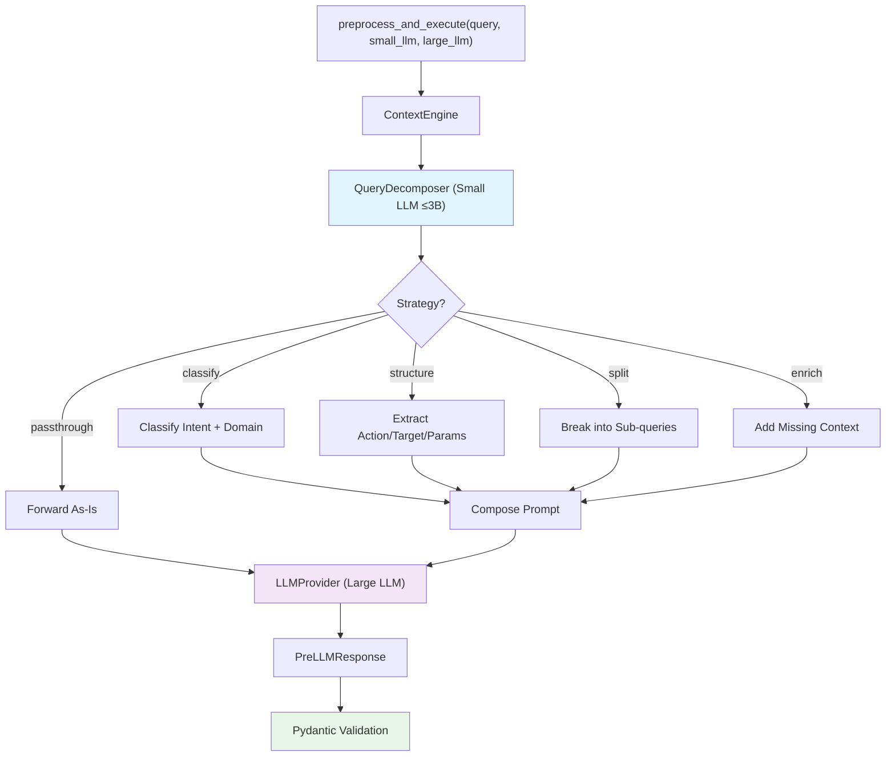
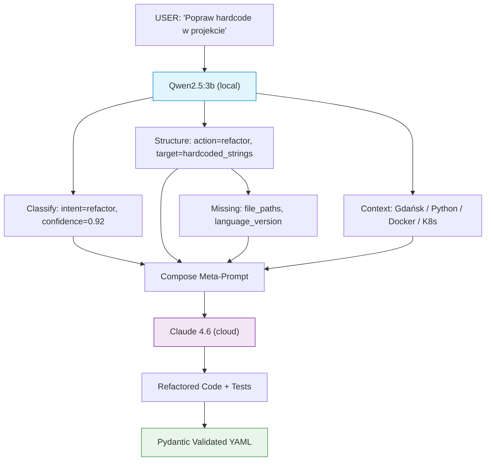
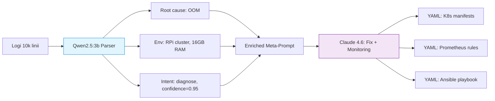
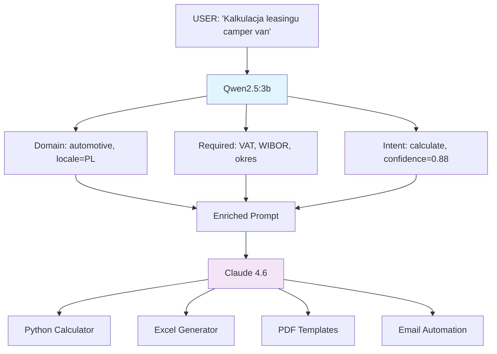
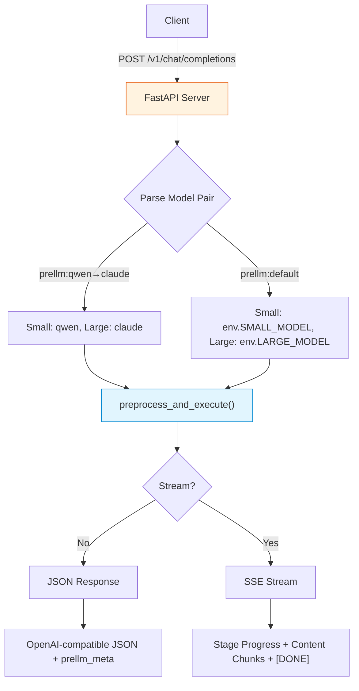
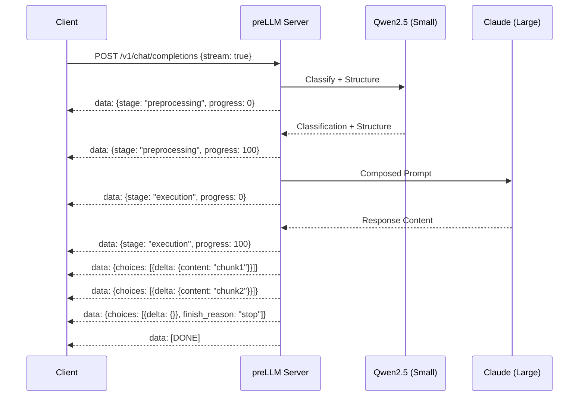
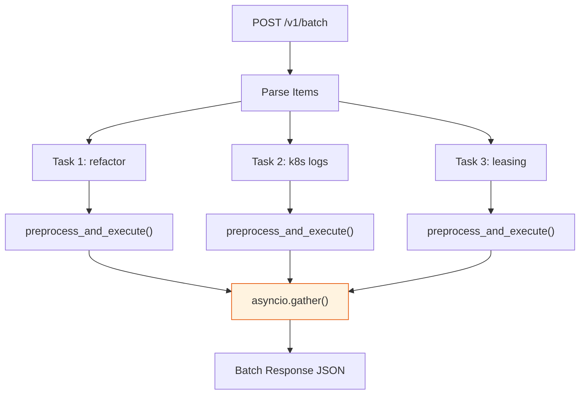
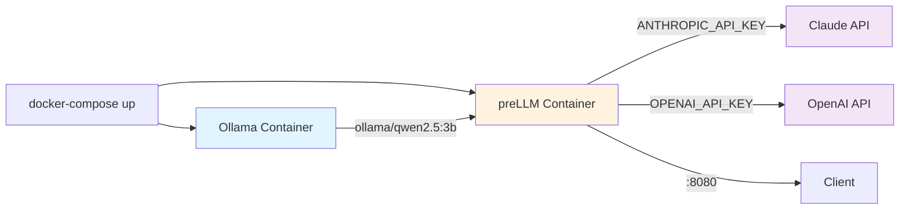
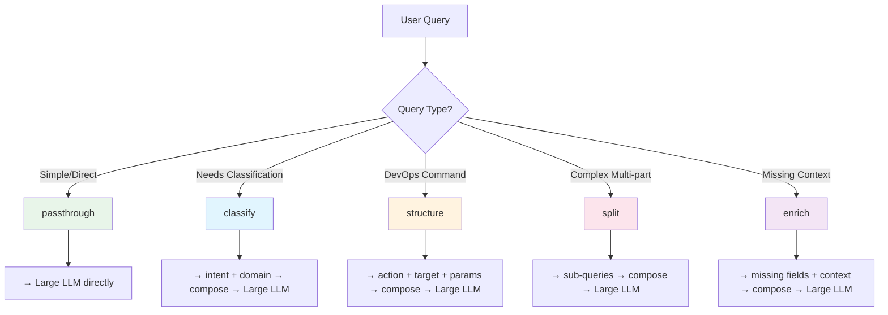

# preLLM Flow Graphs

Mermaid diagrams showing the preLLM preprocessing pipeline for each use case.

## Configuration & Diagnostics

```bash
make config         # interactive wizard + diagnostics
source .env
prellm doctor --live
make examples       # real-time demo scripts
```

## Core Pipeline



## Use Case 1: Code Refactoring



## Use Case 2: Kubernetes Log Analysis



## Use Case 3: Business Automation (Leasing)



## API Server Flow



## Streaming Flow



## Batch Processing Flow



## Docker Deployment



## Strategy Decision Tree


