# System Architecture Analysis

## Overview

- **Project**: /home/tom/github/wronai/prellm
- **Primary Language**: python
- **Languages**: python: 36, shell: 3
- **Analysis Mode**: static
- **Total Functions**: 310
- **Total Classes**: 80
- **Modules**: 39
- **Entry Points**: 238

## Architecture by Module

### prellm.cli
- **Functions**: 24
- **File**: `cli.py`

### scripts.config_wizard
- **Functions**: 19
- **File**: `config_wizard.py`

### prellm.pipeline
- **Functions**: 18
- **Classes**: 5
- **File**: `pipeline.py`

### examples.providers
- **Functions**: 17
- **File**: `providers.py`

### prellm.core
- **Functions**: 17
- **Classes**: 1
- **File**: `core.py`

### prellm.trace
- **Functions**: 16
- **Classes**: 2
- **File**: `trace.py`

### prellm.context.user_memory
- **Functions**: 15
- **Classes**: 1
- **File**: `user_memory.py`

### prellm.context.codebase_indexer
- **Functions**: 14
- **Classes**: 4
- **File**: `codebase_indexer.py`

### prellm.analyzers.context_engine
- **Functions**: 13
- **Classes**: 1
- **File**: `context_engine.py`

### examples.quick_start
- **Functions**: 12
- **File**: `quick_start.py`

### prellm.env_config
- **Functions**: 12
- **Classes**: 1
- **File**: `env_config.py`

### examples.python_sdk
- **Functions**: 11
- **File**: `python_sdk.py`

### prellm.prompt_registry
- **Functions**: 11
- **Classes**: 5
- **File**: `prompt_registry.py`

### prellm.context.sensitive_filter
- **Functions**: 11
- **Classes**: 1
- **File**: `sensitive_filter.py`

### prellm.budget
- **Functions**: 11
- **Classes**: 3
- **File**: `budget.py`

### prellm.query_decomposer
- **Functions**: 10
- **Classes**: 1
- **File**: `query_decomposer.py`

### prellm.context.folder_compressor
- **Functions**: 10
- **Classes**: 1
- **File**: `folder_compressor.py`

### prellm.chains.process_chain
- **Functions**: 10
- **Classes**: 1
- **File**: `process_chain.py`

### prellm.server
- **Functions**: 9
- **Classes**: 10
- **File**: `server.py`

### prellm.context.schema_generator
- **Functions**: 9
- **Classes**: 1
- **File**: `schema_generator.py`

## Key Entry Points

Main execution flows into the system:

### scripts.config_wizard.main
- **Calls**: print, print, print, print, print, print, print, print

### prellm.trace.TraceRecorder.to_stdout
> Generate rich terminal trace with decision tree visualization.
- **Calls**: min, self.config.get, self.config.get, self.config.get, lines.append, lines.append, lines.append, lines.append

### prellm.cli.query
> Preprocess a query with small LLM, then execute with large LLM.
- **Calls**: app.command, typer.Argument, typer.Option, typer.Option, typer.Option, typer.Option, typer.Option, typer.Option

### prellm.trace.TraceRecorder.to_markdown
> Generate full markdown trace document.
- **Calls**: None.strftime, lines.append, lines.append, lines.append, lines.append, lines.append, lines.append, lines.append

### prellm.cli.context
> Show collected environment context, schema, and blocked sensitive data.
- **Calls**: app.command, typer.Option, typer.Option, typer.Option, typer.Option, ShellContextCollector, collector.collect_all, typer.echo

### prellm.cli.context_show_cmd
> Show collected runtime context.
- **Calls**: context_app.command, typer.Option, typer.Option, typer.Option, prellm.cli._init_logging, ContextEngine, engine.gather_runtime, typer.echo

### prellm.cli.decompose
> [v0.2] Decompose a query using small LLM without calling the large model.
- **Calls**: app.command, typer.Argument, typer.Option, typer.Option, typer.Option, PreLLM, DecompositionStrategy, asyncio.run

### prellm.cli.budget
> Show LLM API spend tracking and budget status.

Example:
    prellm budget
    prellm budget --json
    prellm budget --reset
- **Calls**: app.command, typer.Option, typer.Option, prellm.env_config.get_env_config, prellm.budget.get_budget_tracker, tracker.summary, typer.echo, typer.echo

### prellm.cli.config_show_cmd
> Show effective configuration (resolved from all sources).

Example:
    prellm config show
- **Calls**: config_app.command, prellm.env_config.get_env_config, typer.echo, typer.echo, typer.echo, typer.echo, typer.echo, typer.echo

### prellm.core.PreLLM._load_config
> Load preLLM v0.2 config from YAML file.
- **Calls**: raw.get, raw.get, raw.get, raw.get, raw.get, DecompositionStrategy, PreLLMConfig, open

### prellm.context.codebase_indexer.CodebaseIndexer._extract_with_regex
> Fallback: extract symbols using regex patterns.
- **Calls**: content.splitlines, enumerate, re.match, re.match, enumerate, len, symbols.append, symbols.append

### prellm.cli.serve
> Start the OpenAI-compatible API server.

Reads config from .env file (LiteLLM-compatible). CLI args override .env values.

Example:
    prellm serve
 
- **Calls**: app.command, typer.Option, typer.Option, typer.Option, typer.Option, typer.Option, typer.Option, typer.Option

### prellm.pipeline.PromptPipeline.from_yaml
> Load a named pipeline from a YAML file.

Args:
    pipelines_path: Path to pipelines.yaml (or None for default).
    pipeline_name: Name of the pipeli
- **Calls**: raw.get, pipe_data.get, PipelineConfig, cls, Path, open, sorted, KeyError

### prellm.server.chat_completions
> OpenAI-compatible chat completions with preLLM preprocessing.
- **Calls**: app.post, reversed, prellm.server._parse_model_pair, prellm.server._build_prellm_meta, ChatCompletionResponse, HTTPException, HTTPException, PreLLMExtras

### prellm.context.sensitive_filter.SensitiveDataFilter._filter_recursive
> Recursively filter a data structure.
- **Calls**: isinstance, data.items, isinstance, str, self._looks_like_env_var, self._filter_recursive, isinstance, self.classify_key

### prellm.context.codebase_indexer.CodebaseIndexer.get_compressed_context
> Full pipeline: index → compress → filter by query relevance.

Returns text ready for injection into small-LLM prompt.
Guarantees output fits within ma
- **Calls**: FolderCompressor, compressor.compress, query.lower, compressed.module_summaries.items, parts.append, self.estimate_tokens, None.join, any

### prellm.cli.process
> Execute a DevOps process chain.
- **Calls**: app.command, typer.Argument, typer.Option, typer.Option, typer.Option, typer.Option, ProcessChain, asyncio.run

### prellm.cli.doctor
> Check configuration and provider connectivity.

Validates .env config, API keys, and optionally tests live connections.

Example:
    prellm doctor
  
- **Calls**: app.command, typer.Option, typer.Option, prellm.env_config.get_env_config, typer.echo, typer.echo, typer.echo, prellm.cli._doctor_check_config

### prellm.cli.models
> List popular model pairs and provider examples.

Examples:
    prellm models
    prellm models --provider openrouter
    prellm models --search kimi
- **Calls**: app.command, typer.Option, typer.Option, prellm.model_catalog.list_model_pairs, prellm.model_catalog.list_openrouter_models, typer.echo, typer.echo, typer.echo

### prellm.cli.session_list_cmd
> List recent interactions in the session.
- **Calls**: session_app.command, typer.Option, prellm.cli._init_logging, UserMemory, asyncio.run, typer.echo, typer.echo, enumerate

### prellm.cli.session_export_cmd
> Export current session to JSON file.
- **Calls**: session_app.command, typer.Argument, typer.Option, typer.Option, prellm.cli._init_logging, UserMemory, asyncio.run, snapshot.to_file

### prellm.query_decomposer.QueryDecomposer.decompose
> Run the decomposition pipeline for the given strategy.

Args:
    query: The raw user query.
    strategy: Which decomposition strategy to use.
    co
- **Calls**: DecompositionResult, str, self._match_domain_rule, logger.info, self._classify, classification.model_dump, self._find_missing_fields, self._auto_select_strategy

### prellm.context.folder_compressor.FolderCompressor.to_toon
> Format index as .toon — standardized compact representation.
- **Calls**: lines.append, lines.append, lines.append, lines.append, None.join, Path, prellm.context.folder_compressor._relative_path, lines.append

### prellm.context.sensitive_filter.SensitiveDataFilter._load_rules
> Load custom sensitive rules from YAML.
- **Calls**: None.get, None.get, None.get, raw.get, open, self._sensitive_key_patterns.append, self._masked_patterns.append, self._safe_keys.add

### examples.k8s_debug.main
- **Calls**: print, print, print, print, print, print, print, print

### examples.embedded_refactor.main
- **Calls**: print, print, print, print, print, print, print, print

### examples.polish_leasing.main
- **Calls**: print, print, print, print, print, print, print, print

### examples.python_sdk.example_custom_pipeline
> Build a pipeline from components for maximum flexibility.
- **Calls**: PromptRegistry, LLMProvider, LLMProvider, PromptPipeline.from_yaml, PreprocessorAgent, ExecutorAgent, print, print

### prellm.prompt_registry.PromptRegistry._load
> Load prompts from the YAML file.
- **Calls**: raw.get, prompts_raw.items, logger.debug, self._path.exists, logger.warning, open, isinstance, yaml.safe_load

### prellm.context.user_memory.UserMemory._get_all_interactions
> Get all interactions for export.
- **Calls**: self._conn.execute, self._chroma_collection.get, enumerate, json.loads, cursor.fetchall, results.get, doc.split, items.append

## Process Flows

Key execution flows identified:

### Flow 1: main
```
main [scripts.config_wizard]
```

### Flow 2: to_stdout
```
to_stdout [prellm.trace.TraceRecorder]
```

### Flow 3: query
```
query [prellm.cli]
```

### Flow 4: to_markdown
```
to_markdown [prellm.trace.TraceRecorder]
```

### Flow 5: context
```
context [prellm.cli]
```

### Flow 6: context_show_cmd
```
context_show_cmd [prellm.cli]
  └─> _init_logging
      └─ →> get_env_config
          └─> load_dotenv_if_available
      └─ →> setup_logging
```

### Flow 7: decompose
```
decompose [prellm.cli]
```

### Flow 8: budget
```
budget [prellm.cli]
  └─ →> get_env_config
      └─> load_dotenv_if_available
  └─ →> get_budget_tracker
```

### Flow 9: config_show_cmd
```
config_show_cmd [prellm.cli]
  └─ →> get_env_config
      └─> load_dotenv_if_available
```

### Flow 10: _load_config
```
_load_config [prellm.core.PreLLM]
```

## Key Classes

### prellm.pipeline.PromptPipeline
> Generic pipeline — executes a sequence of LLM + algorithmic steps.

Usage:
    pipeline = PromptPipe
- **Methods**: 18
- **Key Methods**: prellm.pipeline.PromptPipeline.__init__, prellm.pipeline.PromptPipeline.from_yaml, prellm.pipeline.PromptPipeline.execute, prellm.pipeline.PromptPipeline._execute_llm_step, prellm.pipeline.PromptPipeline._execute_algo_step, prellm.pipeline.PromptPipeline._gather_inputs, prellm.pipeline.PromptPipeline._build_user_message, prellm.pipeline.PromptPipeline._evaluate_condition, prellm.pipeline.PromptPipeline.register_algo_handler, prellm.pipeline.PromptPipeline._algo_domain_rule_matcher

### prellm.context.user_memory.UserMemory
> Stores user query history and learned preferences.

Usage:
    # SQLite (default, no extra deps)
   
- **Methods**: 15
- **Key Methods**: prellm.context.user_memory.UserMemory.__init__, prellm.context.user_memory.UserMemory._init_sqlite, prellm.context.user_memory.UserMemory._init_chromadb, prellm.context.user_memory.UserMemory.add_interaction, prellm.context.user_memory.UserMemory.get_recent_context, prellm.context.user_memory.UserMemory.get_user_preferences, prellm.context.user_memory.UserMemory.set_preference, prellm.context.user_memory.UserMemory.clear, prellm.context.user_memory.UserMemory.export_session, prellm.context.user_memory.UserMemory.import_session

### prellm.context.codebase_indexer.CodebaseIndexer
> Index a codebase using tree-sitter for AST-based symbol extraction.

Usage:
    indexer = CodebaseIn
- **Methods**: 14
- **Key Methods**: prellm.context.codebase_indexer.CodebaseIndexer.__init__, prellm.context.codebase_indexer.CodebaseIndexer._check_tree_sitter, prellm.context.codebase_indexer.CodebaseIndexer.index_directory, prellm.context.codebase_indexer.CodebaseIndexer._index_file, prellm.context.codebase_indexer.CodebaseIndexer._extract_with_tree_sitter, prellm.context.codebase_indexer.CodebaseIndexer._get_parser, prellm.context.codebase_indexer.CodebaseIndexer._walk_tree, prellm.context.codebase_indexer.CodebaseIndexer._get_line, prellm.context.codebase_indexer.CodebaseIndexer._extract_with_regex, prellm.context.codebase_indexer.CodebaseIndexer._extract_imports

### prellm.analyzers.context_engine.ContextEngine
> Collects context from environment, git, and system for prompt enrichment.

Used by both core Prellm 
- **Methods**: 13
- **Key Methods**: prellm.analyzers.context_engine.ContextEngine.__init__, prellm.analyzers.context_engine.ContextEngine.gather, prellm.analyzers.context_engine.ContextEngine.enrich_prompt, prellm.analyzers.context_engine.ContextEngine.gather_runtime, prellm.analyzers.context_engine.ContextEngine._auto_collect_env, prellm.analyzers.context_engine.ContextEngine._gather_process, prellm.analyzers.context_engine.ContextEngine._gather_locale, prellm.analyzers.context_engine.ContextEngine._gather_network, prellm.analyzers.context_engine.ContextEngine._gather_env, prellm.analyzers.context_engine.ContextEngine._gather_git

### prellm.context.sensitive_filter.SensitiveDataFilter
> Classifies and filters sensitive data from context before LLM calls.
- **Methods**: 11
- **Key Methods**: prellm.context.sensitive_filter.SensitiveDataFilter.__init__, prellm.context.sensitive_filter.SensitiveDataFilter._load_rules, prellm.context.sensitive_filter.SensitiveDataFilter.classify_key, prellm.context.sensitive_filter.SensitiveDataFilter.classify_value, prellm.context.sensitive_filter.SensitiveDataFilter.filter_dict, prellm.context.sensitive_filter.SensitiveDataFilter.filter_context_for_large_llm, prellm.context.sensitive_filter.SensitiveDataFilter.sanitize_text, prellm.context.sensitive_filter.SensitiveDataFilter.get_filter_report, prellm.context.sensitive_filter.SensitiveDataFilter._filter_recursive, prellm.context.sensitive_filter.SensitiveDataFilter._looks_like_env_var

### prellm.query_decomposer.QueryDecomposer
> Decomposes user queries using a small LLM before routing to a large model.

Supports 5 strategies:
 
- **Methods**: 10
- **Key Methods**: prellm.query_decomposer.QueryDecomposer.__init__, prellm.query_decomposer.QueryDecomposer.decompose, prellm.query_decomposer.QueryDecomposer._classify, prellm.query_decomposer.QueryDecomposer._structure, prellm.query_decomposer.QueryDecomposer._split, prellm.query_decomposer.QueryDecomposer._enrich, prellm.query_decomposer.QueryDecomposer._compose, prellm.query_decomposer.QueryDecomposer._match_domain_rule, prellm.query_decomposer.QueryDecomposer._auto_select_strategy, prellm.query_decomposer.QueryDecomposer._find_missing_fields

### prellm.chains.process_chain.ProcessChain
> Execute multi-step DevOps workflows with preLLM validation at each step.

Usage:
    from prellm.cor
- **Methods**: 10
- **Key Methods**: prellm.chains.process_chain.ProcessChain.__init__, prellm.chains.process_chain.ProcessChain.execute, prellm.chains.process_chain.ProcessChain._execute_step, prellm.chains.process_chain.ProcessChain._check_dependencies, prellm.chains.process_chain.ProcessChain._handle_approval, prellm.chains.process_chain.ProcessChain._run_dry_run, prellm.chains.process_chain.ProcessChain._run_engine, prellm.chains.process_chain.ProcessChain.get_audit_log, prellm.chains.process_chain.ProcessChain._audit_step, prellm.chains.process_chain.ProcessChain._load_process_config

### prellm.budget.BudgetTracker
> Tracks LLM API spend against a monthly budget.

Usage:
    tracker = BudgetTracker(monthly_limit=50.
- **Methods**: 10
- **Key Methods**: prellm.budget.BudgetTracker._ensure_loaded, prellm.budget.BudgetTracker.check, prellm.budget.BudgetTracker.record, prellm.budget.BudgetTracker.record_from_response, prellm.budget.BudgetTracker.total_cost, prellm.budget.BudgetTracker.remaining, prellm.budget.BudgetTracker.entries, prellm.budget.BudgetTracker.summary, prellm.budget.BudgetTracker._persist, prellm.budget.BudgetTracker.reset

### prellm.prompt_registry.PromptRegistry
> Loads prompts from YAML, caches, validates placeholders.

Usage:
    registry = PromptRegistry()
   
- **Methods**: 9
- **Key Methods**: prellm.prompt_registry.PromptRegistry.__init__, prellm.prompt_registry.PromptRegistry._ensure_loaded, prellm.prompt_registry.PromptRegistry._load, prellm.prompt_registry.PromptRegistry.get, prellm.prompt_registry.PromptRegistry.get_entry, prellm.prompt_registry.PromptRegistry.list_prompts, prellm.prompt_registry.PromptRegistry.validate, prellm.prompt_registry.PromptRegistry.register, prellm.prompt_registry.PromptRegistry._render

### prellm.context.schema_generator.ContextSchemaGenerator
> Generates a structured context schema from available context sources.
- **Methods**: 9
- **Key Methods**: prellm.context.schema_generator.ContextSchemaGenerator.generate, prellm.context.schema_generator.ContextSchemaGenerator.to_prompt_section, prellm.context.schema_generator.ContextSchemaGenerator.estimate_relevance, prellm.context.schema_generator.ContextSchemaGenerator._detect_execution_env, prellm.context.schema_generator.ContextSchemaGenerator._detect_tools, prellm.context.schema_generator.ContextSchemaGenerator._detect_project_type, prellm.context.schema_generator.ContextSchemaGenerator._build_project_summary, prellm.context.schema_generator.ContextSchemaGenerator._summarize_history, prellm.context.schema_generator.ContextSchemaGenerator._estimate_token_cost

### prellm.trace.TraceRecorder
> Records execution trace and generates markdown documentation.
- **Methods**: 8
- **Key Methods**: prellm.trace.TraceRecorder.start, prellm.trace.TraceRecorder.stop, prellm.trace.TraceRecorder.step, prellm.trace.TraceRecorder.set_result, prellm.trace.TraceRecorder.total_duration_ms, prellm.trace.TraceRecorder.to_markdown, prellm.trace.TraceRecorder.to_stdout, prellm.trace.TraceRecorder.save

### prellm.validators.ResponseValidator
> Validates LLM responses against YAML-defined schemas.

Usage:
    validator = ResponseValidator()
  
- **Methods**: 8
- **Key Methods**: prellm.validators.ResponseValidator.__init__, prellm.validators.ResponseValidator._ensure_loaded, prellm.validators.ResponseValidator._load, prellm.validators.ResponseValidator.list_schemas, prellm.validators.ResponseValidator.validate, prellm.validators.ResponseValidator.validate_or_retry, prellm.validators.ResponseValidator._check_type, prellm.validators.ResponseValidator._check_constraints

### prellm.context.shell_collector.ShellContextCollector
> Collects full shell environment context for LLM prompt enrichment.
- **Methods**: 8
- **Key Methods**: prellm.context.shell_collector.ShellContextCollector.__init__, prellm.context.shell_collector.ShellContextCollector.collect_env_vars, prellm.context.shell_collector.ShellContextCollector.collect_process_info, prellm.context.shell_collector.ShellContextCollector.collect_locale_info, prellm.context.shell_collector.ShellContextCollector.collect_shell_info, prellm.context.shell_collector.ShellContextCollector.collect_network_context, prellm.context.shell_collector.ShellContextCollector.collect_all, prellm.context.shell_collector.ShellContextCollector._is_safe_key

### prellm.core.PreLLM
> preLLM v0.2/v0.3 — small LLM decomposition before large LLM routing.

Usage:
    engine = PreLLM("pr
- **Methods**: 6
- **Key Methods**: prellm.core.PreLLM.__init__, prellm.core.PreLLM.__call__, prellm.core.PreLLM.decompose_only, prellm.core.PreLLM.get_audit_log, prellm.core.PreLLM._audit, prellm.core.PreLLM._load_config

### prellm.llm_provider.LLMProvider
> Unified LLM caller with retry and fallback support.

Usage:
    provider = LLMProvider(LLMProviderCo
- **Methods**: 6
- **Key Methods**: prellm.llm_provider.LLMProvider.__init__, prellm.llm_provider.LLMProvider._get_budget, prellm.llm_provider.LLMProvider.complete, prellm.llm_provider.LLMProvider.complete_json, prellm.llm_provider.LLMProvider.complete_structured, prellm.llm_provider.LLMProvider._parse_json

### prellm.context.folder_compressor.FolderCompressor
> Compresses a project folder into a lightweight representation for LLM context.
- **Methods**: 6
- **Key Methods**: prellm.context.folder_compressor.FolderCompressor.__init__, prellm.context.folder_compressor.FolderCompressor.compress, prellm.context.folder_compressor.FolderCompressor.to_toon, prellm.context.folder_compressor.FolderCompressor.to_dependency_graph, prellm.context.folder_compressor.FolderCompressor.to_summary, prellm.context.folder_compressor.FolderCompressor.estimate_token_count

### prellm.agents.preprocessor.PreprocessorAgent
> Agent preprocessing — small LLM (≤24B) analyzes and structures queries.

Usage:
    agent = Preproce
- **Methods**: 4
- **Key Methods**: prellm.agents.preprocessor.PreprocessorAgent.__init__, prellm.agents.preprocessor.PreprocessorAgent.preprocess, prellm.agents.preprocessor.PreprocessorAgent._extract_executor_input, prellm.agents.preprocessor.PreprocessorAgent._extract_confidence

### prellm.agents.executor.ExecutorAgent
> Agent execution — large LLM (>24B) executes structured tasks.

Usage:
    agent = ExecutorAgent(
   
- **Methods**: 3
- **Key Methods**: prellm.agents.executor.ExecutorAgent.__init__, prellm.agents.executor.ExecutorAgent.execute, prellm.agents.executor.ExecutorAgent._validate_response

### prellm.prompt_registry.PromptEntry
> Single prompt entry with template, max_tokens, and temperature.
- **Methods**: 2
- **Key Methods**: prellm.prompt_registry.PromptEntry.__init__, prellm.prompt_registry.PromptEntry.__repr__

### prellm.models.SessionSnapshot
> Exportable session snapshot — enables persistent context across restarts.

Equivalent to LM Studio '
- **Methods**: 2
- **Key Methods**: prellm.models.SessionSnapshot.to_file, prellm.models.SessionSnapshot.from_file
- **Inherits**: BaseModel

## Data Transformation Functions

Key functions that process and transform data:

### prellm.cli.process
> Execute a DevOps process chain.
- **Output to**: app.command, typer.Argument, typer.Option, typer.Option, typer.Option

### prellm.cli._format_config_sections
> Group config entries into categorized sections for display.
- **Output to**: entries.items, None.append, None.append, var.startswith, None.append

### prellm.trace._format_tree_value
> Format a value for display in the decision tree — no truncation.
- **Output to**: isinstance, str, isinstance, json.dumps, val.replace

### prellm.prompt_registry.PromptRegistry.validate
> Validate that all prompts have non-empty templates. Returns list of error messages.
- **Output to**: self._ensure_loaded, set, self._entries.items, self._entries.keys, errors.append

### prellm.core.preprocess_and_execute
> One function to preprocess and execute — like litellm.completion() but with small LLM decomposition.
- **Output to**: logger.info, prellm.trace.get_current_trace, PreLLM._load_config, trace.step, prellm.core._execute_v3_pipeline

### prellm.core.preprocess_and_execute_sync
> Synchronous version of preprocess_and_execute() — runs the async function in an event loop.

Usage:

- **Output to**: asyncio.run, prellm.core.preprocess_and_execute

### prellm.core._run_preprocessing
> Run the small-LLM preprocessing step. Returns (prep_result, duration_ms).
- **Output to**: time.time, preprocessor.preprocess, time.time

### prellm.llm_provider.LLMProvider._parse_json
> Best-effort JSON extraction from LLM output.
- **Output to**: text.strip, logger.warning, json.loads, text.split, text.find

### prellm.pipeline.PromptPipeline._algo_yaml_formatter
> Format pipeline state into structured executor input.
- **Output to**: inputs.get, state.get, state.get, isinstance, str

### prellm.server._parse_model_pair
> Parse 'prellm:qwen→claude' or 'prellm:small→large' into (small, large) model strings.

Special cases
- **Output to**: model_str.split, None.lower, pair.split, len, pair.split

### prellm.server.batch_process
> Process multiple queries in parallel.
- **Output to**: app.post, HTTPException, asyncio.gather, list, prellm.core.preprocess_and_execute

### prellm.validators.ResponseValidator.validate
> Validate a dict against a named schema.

Args:
    data: The data dict to validate (typically parsed
- **Output to**: self._ensure_loaded, self._schemas.get, schema.types.items, schema.constraints.items, ValidationResult

### prellm.validators.ResponseValidator.validate_or_retry
> Validate, and if invalid, call retry_fn and try again.

Args:
    data: Initial data to validate.
  
- **Output to**: self.validate, logger.info, retry_fn, self.validate

### scripts.config_wizard.validate_ollama_model
- **Output to**: scripts.config_wizard.strip_ollama_prefix, scripts.config_wizard.warn, scripts.config_wizard.info, scripts.config_wizard.ask_yn, scripts.config_wizard.ask_yn

### scripts.config_wizard.check_api_key_format
> Validate API key format.
- **Output to**: patterns.get, re.match, scripts.config_wizard.ok, scripts.config_wizard.warn

### prellm.chains.process_chain.ProcessChain._load_process_config
- **Output to**: raw.get, ProcessConfig, open, steps.append, yaml.safe_load

### prellm.context.shell_collector.ShellContextCollector.collect_process_info
> Collect current process information.
- **Output to**: ProcessInfo, hasattr, os.ttyname, os.getpid, os.getcwd

### prellm.analyzers.context_engine.ContextEngine._gather_process
> PID, CWD, user, parent PID, TTY.
- **Output to**: os.getpid, os.getcwd, os.environ.get, hasattr, os.ttyname

### prellm.analyzers.context_engine.ContextEngine._gather_git_subprocess
> Fallback: gather git info using subprocess calls.
- **Output to**: git_commands.get, subprocess.run, out.stdout.strip

### prellm.agents.executor.ExecutorAgent._validate_response
> Validate response content against the configured schema.
- **Output to**: self.response_validator.validate, json.loads, isinstance, self.response_validator.validate

### prellm.agents.preprocessor.PreprocessorAgent.preprocess
> Preprocess a query and return structured input for the Executor.

Args:
    query: The raw user quer
- **Output to**: self.context_engine.gather, self._extract_executor_input, self._extract_confidence, PreprocessResult, self.pipeline.execute

### prellm.context.codebase_indexer.CodebaseIndexer._get_parser
> Get or create a tree-sitter parser for the given language.
- **Output to**: __import__, tree_sitter.Language, tree_sitter.Parser, lang_module.language, logger.debug

## Behavioral Patterns

### recursion__sanitize
- **Type**: recursion
- **Confidence**: 0.90
- **Functions**: prellm.trace._sanitize

## Public API Surface

Functions exposed as public API (no underscore prefix):

- `scripts.config_wizard.main` - 144 calls
- `prellm.trace.TraceRecorder.to_stdout` - 91 calls
- `prellm.cli.query` - 76 calls
- `prellm.trace.TraceRecorder.to_markdown` - 75 calls
- `prellm.cli.context` - 50 calls
- `prellm.cli.context_show_cmd` - 44 calls
- `prellm.cli.decompose` - 30 calls
- `prellm.env_config.get_env_config` - 27 calls
- `prellm.cli.budget` - 26 calls
- `prellm.cli.config_show_cmd` - 25 calls
- `prellm.cli.serve` - 22 calls
- `prellm.pipeline.PromptPipeline.from_yaml` - 22 calls
- `prellm.server.chat_completions` - 22 calls
- `prellm.context.codebase_indexer.CodebaseIndexer.get_compressed_context` - 21 calls
- `prellm.cli.process` - 20 calls
- `prellm.env_config.load_dotenv_if_available` - 18 calls
- `prellm.cli.doctor` - 18 calls
- `prellm.cli.models` - 18 calls
- `prellm.cli.session_list_cmd` - 18 calls
- `prellm.env_config.config_list` - 17 calls
- `prellm.cli.session_export_cmd` - 17 calls
- `prellm.query_decomposer.QueryDecomposer.decompose` - 17 calls
- `prellm.context.folder_compressor.FolderCompressor.to_toon` - 17 calls
- `examples.k8s_debug.main` - 16 calls
- `examples.embedded_refactor.main` - 16 calls
- `examples.polish_leasing.main` - 15 calls
- `examples.python_sdk.example_custom_pipeline` - 15 calls
- `prellm.cli.session_import_cmd` - 14 calls
- `prellm.pipeline.PromptPipeline.execute` - 14 calls
- `prellm.context.folder_compressor.FolderCompressor.to_dependency_graph` - 14 calls
- `prellm.context.user_memory.UserMemory.get_recent_context` - 14 calls
- `prellm.analyzers.context_engine.ContextEngine.gather_runtime` - 14 calls
- `prellm.context.codebase_indexer.CodebaseIndexer.index_directory` - 14 calls
- `prellm.env_config.check_providers_live` - 13 calls
- `prellm.cli.config_list_cmd` - 13 calls
- `prellm.validators.ResponseValidator.validate` - 13 calls
- `scripts.config_wizard.ask_choice` - 13 calls
- `prellm.chains.process_chain.ProcessChain.execute` - 13 calls
- `prellm.agents.preprocessor.PreprocessorAgent.preprocess` - 13 calls
- `examples.python_sdk.example_one_function` - 12 calls

## System Interactions

How components interact:

```mermaid
graph TD
    main --> print
    to_stdout --> min
    to_stdout --> get
    to_stdout --> append
    query --> command
    query --> Argument
    query --> Option
    to_markdown --> strftime
    to_markdown --> append
    context --> command
    context --> Option
    context_show_cmd --> command
    context_show_cmd --> Option
    context_show_cmd --> _init_logging
    decompose --> command
    decompose --> Argument
    decompose --> Option
    budget --> command
    budget --> Option
    budget --> get_env_config
    budget --> get_budget_tracker
    config_show_cmd --> command
    config_show_cmd --> get_env_config
    config_show_cmd --> echo
    _load_config --> get
    _extract_with_regex --> splitlines
    _extract_with_regex --> enumerate
    _extract_with_regex --> match
    serve --> command
    serve --> Option
```



## Reverse Engineering Guidelines

1. **Entry Points**: Start analysis from the entry points listed above
2. **Core Logic**: Focus on classes with many methods
3. **Data Flow**: Follow data transformation functions
4. **Process Flows**: Use the flow diagrams for execution paths
5. **API Surface**: Public API functions reveal the interface

## Context for LLM

Maintain the identified architectural patterns and public API surface when suggesting changes.